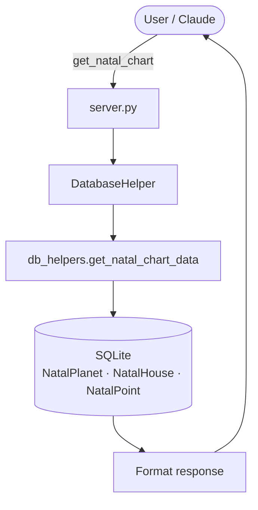
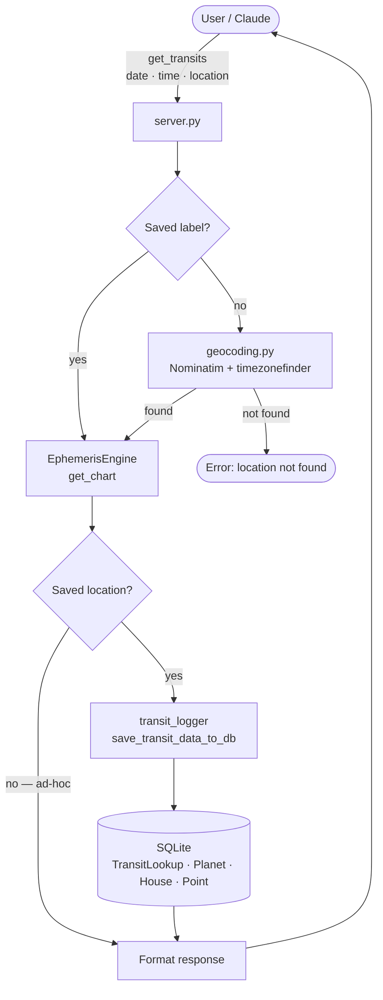
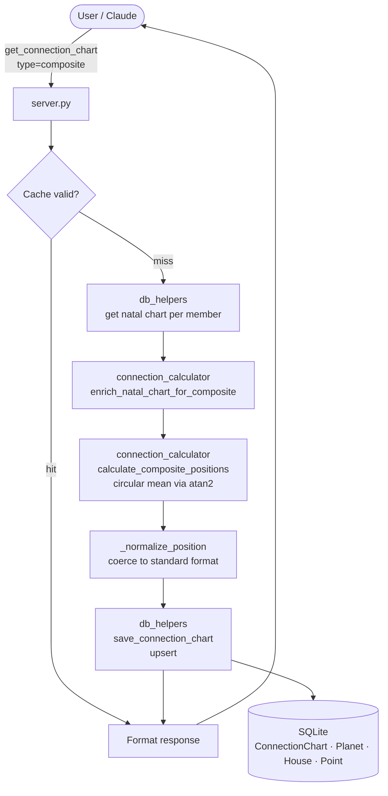
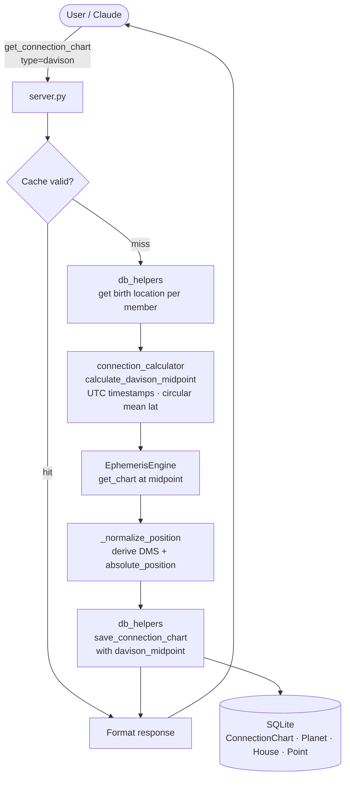
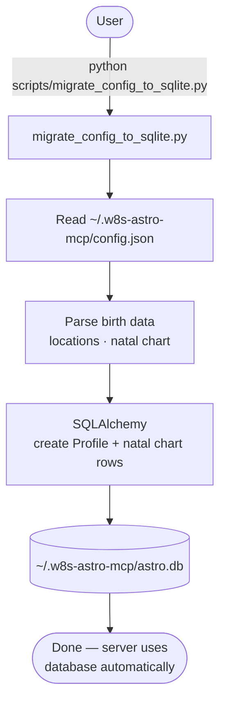

# Project Architecture

## Directory Structure

```
src/w8s_astro_mcp/
├── Core MCP Server
│   ├── __init__.py
│   ├── __main__.py              # Entry point
│   └── server.py                # MCP server — tool registry & routing
│
├── Database Layer
│   ├── database.py              # SQLAlchemy engine, session management
│   └── models/                  # SQLAlchemy ORM models (17 models)
│       ├── __init__.py
│       ├── app_settings.py      # Global settings (current profile ID)
│       ├── house_system.py      # 7 house systems (Placidus, Koch, etc.)
│       ├── location.py          # Birth/home/saved locations (profile-owned)
│       ├── profile.py           # People's natal charts
│       ├── natal_planet.py      # Planet positions at birth
│       ├── natal_house.py       # House cusps at birth
│       ├── natal_point.py       # Angles (ASC, MC) at birth
│       ├── transit_lookup.py    # Record of every transit check
│       ├── transit_planet.py    # Planet positions for a transit
│       ├── transit_house.py     # House cusps for a transit
│       ├── transit_point.py     # Angles for a transit
│       ├── connection.py        # Named group of 2+ profiles
│       ├── connection_member.py # Many-to-many: connection ↔ profile
│       ├── connection_chart.py  # Cached composite/Davison chart metadata
│       ├── connection_planet.py # Planet positions in a connection chart
│       ├── connection_house.py  # House cusps in a connection chart
│       └── connection_point.py  # Angles in a connection chart
│
├── Analysis & Visualization
│   └── tools/                   # MCP tool handlers
│       ├── __init__.py
│       ├── analysis_tools.py    # Aspects, house placements
│       ├── visualization.py     # Chart drawing (matplotlib)
│       ├── profile_management.py # Profile/location CRUD tools
│       └── connection_management.py # Connection/composite/Davison tools
│
├── Ephemeris & Utilities
│   └── utils/
│       ├── __init__.py
│       ├── ephemeris.py         # EphemerisEngine — pysweph wrapper, chart calculation
│       ├── constants.py         # ZODIAC_SIGNS, PLANET_IDS, HOUSE_SYSTEM_CODES
│       ├── db_helpers.py        # High-level database queries
│       ├── connection_calculator.py # Composite & Davison math
│       ├── position_utils.py    # Shared position conversion functions
│       ├── transit_logger.py    # Save transit data to database
│       └── geocoding.py         # Nominatim geocoding + IANA timezone lookup (timezonefinder)
│
```

## Data Flow

### Natal Chart Query



### Transit Query (with Auto-Logging)



### Composite Chart (pure math, no ephemeris call)



### Davison Chart (EphemerisEngine required)



### Migration (one-time setup)



## Key Design Decisions

### 1. Database-First Architecture
- **Old:** config.json with cached natal chart
- **New:** SQLite with normalized schema
- **Why:** Enables multi-profile, transit history, proper queries

### 2. AppSettings Table for Global State
- **Old:** Profile.is_primary boolean flag
- **New:** AppSettings.current_profile_id foreign key
- **Why:** Cleaner architecture, ON DELETE SET NULL cascade, more extensible

### 3. Profile-Owned Locations
- **Decision:** All locations require profile_id (no shared/global locations)
- **Why:** Simpler mental model, easier CASCADE deletion, clearer ownership

### 4. Separation of Concerns
- **Models:** Define data structure (SQLAlchemy ORM)
- **Database:** Handle connections, sessions
- **db_helpers:** Provide high-level queries for the server
- **transit_logger:** Handle complex transit inserts
- **connection_calculator:** Pure math — composite means, Davison midpoints
- **position_utils:** Shared low-level conversion functions
- **server.py:** Orchestrate tool routing only

### 5. Auto-Logging Transit Requests
- Every `get_transits` call with a **saved location** logs to database automatically
- Preserves location snapshot for historical accuracy
- Builds queryable history over time
- Graceful degradation (logging failures don't break the request)
- Ad-hoc geocoded locations (inline city names) are intentionally not logged — they have no stable profile FK and would pollute history with one-off lookups

### 6. Connection Chart Caching
- Composite and Davison charts are expensive to compute and deterministic
- Results cached in `connection_charts` + child tables
- `is_valid` flag allows invalidation without deletion
- Adding/removing a connection member invalidates all charts for that connection
- Upsert pattern: recalculating replaces rows, never duplicates

### 7. Position Format Normalization (`_normalize_position`)
- Two sources produce position dicts with different shapes:
  - **Composite math:** `degree` (int), `minutes`, `seconds`, `absolute_position` all present
  - **EphemerisEngine output:** `degree` (decimal float within sign), no `minutes`/`seconds`/`absolute_position`
- `DatabaseHelper._normalize_position()` coerces either format before any DB write
- Reuses `decimal_to_dms()` and `sign_to_absolute_position()` from `position_utils.py`

### 8. `position_utils.py` — Shared Conversion Module
- `decimal_to_dms()` and `sign_to_absolute_position()` were originally defined in `transit_logger.py` but were needed by `db_helpers.py` too
- Extracted to `utils/position_utils.py` to eliminate cross-module dependency on a persistence module
- `transit_logger.py` now imports from `position_utils` (no behaviour change)

### 9. DatabaseHelper Test Mode
- `DatabaseHelper.__init__()` accepts an optional `db_path` argument
- When provided: creates the file if needed and runs `create_tables()` automatically
- When omitted: production behaviour — uses `get_database_path()`, raises on missing DB
- Enables real integration tests against isolated SQLite files without mocking

## Technology Stack

**Core:**
- Python 3.14
- MCP (Model Context Protocol) server
- SQLAlchemy 2.0 ORM
- SQLite database

**External:**
- pysweph (Python Swiss Ephemeris extension — no binary required)
- matplotlib (chart visualization)
- timezonefinder (offline IANA timezone lookup from coordinates)

**Dev:**
- pytest (302 tests)
- git (version control)

## Database Schema

See `docs/DATABASE_SCHEMA.md` for full schema documentation.

**21 Models across 4 domains:**

Profiles & Locations (4):
1. AppSettings — global state (current profile ID)
2. HouseSystem — reference data (7 house systems)
3. Location — profile-owned locations
4. Profile — people's natal charts

Natal Charts (3):
5. NatalPlanet, 6. NatalHouse, 7. NatalPoint

Transit History (4):
8. TransitLookup, 9. TransitPlanet, 10. TransitHouse, 11. TransitPoint

Connections — Phase 7 (6):
12. Connection — named group of 2+ profiles
13. ConnectionMember — join table
14. ConnectionChart — cached chart metadata + Davison midpoint
15. ConnectionPlanet, 16. ConnectionHouse, 17. ConnectionPoint

Event Charts — Phase 8 (4):
18. Event — chart metadata (date, time, location, optional profile FK)
19. EventPlanet, 20. EventHouse, 21. EventPoint

## MCP Tools (30 total)

**Core (9):**
check_ephemeris, download_ephemeris_files, setup_astro_config (deprecated), view_config, get_natal_chart, get_transits, compare_charts, find_house_placements, visualize_natal_chart

**Profile Management (7):**
list_profiles, create_profile, update_profile, delete_profile, set_current_profile, add_location, remove_location

**Transit History & Forecasting — Phase 4 (3):**
get_transit_history, find_last_transit, get_ingresses

**Connection Management — Phase 7 (6):**
create_connection, list_connections, add_connection_member, remove_connection_member, get_connection_chart, delete_connection

**Event Charts & Electional Astrology — Phase 8 (4):**
cast_event_chart, list_event_charts, delete_event_chart, find_electional_windows

Note: `compare_charts` also accepts `event:<label>` as a chart source.

## Future Enhancements

### Planned:
- [ ] Statistics ("how often do I check Mercury?")
- [ ] Database self-healing tools (repair inconsistencies)

### Possible:
- [ ] Web interface for database queries
- [ ] Export transit history to CSV
- [ ] Progressive natal chart (age progression)
- [ ] More house systems (Whole Sign, Equal, etc.)
- [ ] Aspects table (natal-natal, transit-natal, transit-transit)
- [ ] Progressions and solar/lunar returns

---

## Design Decisions

Intentional choices that may look like limitations — with the reasoning and path to changing them.

### get_ingresses — Extended Mode Omits Inner Planets

When `extended=True`, only outer planets (Jupiter through Pluto) are returned. Inner planets (Sun, Moon, Mercury, Venus, Mars) are excluded.

**Why:** Inner planets move fast. Over a multi-year window the Moon alone produces ~146 sign changes per year, Mercury ~15–20, the Sun ~12. A 10-year extended scan would return 1,500+ Moon events — noise, not signal. The primary use case for extended mode is historical or far-future context where outer planet cycles are what matter ("what were the major alignments during the Renaissance?", "when does Pluto enter Aquarius?", "what was the outer planet weather during the life of Jesus?").

**To change this:** Open an issue. The right solution is one of:

1. A `planets` filter parameter on `get_ingresses`
2. A separate `get_inner_planet_ingresses` tool designed for high-volume paginated output

The constraint exists to keep output readable for the primary user (an AI assistant), not as a permanent architectural limitation.

### get_ingresses — Offset and Days Caps

Normal mode: `offset` 0–36,500 days (~100 years), `days` 1–365.
Extended mode: `offset` uncapped (Swiss Ephemeris supports 13,000 BCE – 17,000 CE), `days` 1–3,650.

The 10-year scan cap in extended mode keeps results manageable (~180 events max with outer planets only). For longer ranges, call the tool multiple times with different offsets. The 36,500-day offset cap in normal mode covers retirement planning, generational forecasting, and most practical predictive astrology.

### 10. Inline Location Geocoding (`get_transits`)

`get_transits` resolves the `location` parameter in priority order:

1. Special keywords: `current` / `home` → current home location from DB
2. `birth` → birth location from DB
3. Saved label match (profile-owned locations)
4. Geocode via Nominatim (OpenStreetMap) — any city name that resolves

The old `geocoding.py` used a longitude-band estimate for timezones (US-only, UTC elsewhere). This was replaced with `timezonefinder`, which does a full polygon lookup against the IANA timezone database — necessary for correctness on historical queries in non-US locations (e.g. Bangkok 1995 would have returned UTC instead of Asia/Bangkok).

Ad-hoc locations from step 4 are never saved to the profile or logged to transit history. They exist only for the duration of that ephemeris call.

### 11. Optional Persistence for Event Charts — Phase 8
`cast_event_chart` accepts an optional `label`. Without a label the chart is calculated and returned but never written to the database — frictionless for ad-hoc historical lookups. With a label the chart is saved and becomes addressable by `event:<label>` in `compare_charts` and `list_event_charts`. This mirrors the inline geocoding pattern from Phase 5.

### 12. Void-of-Course Moon Detection — Phase 8
`find_electional_windows` uses a full applying-aspect check for `moon_not_void`, not a heuristic. The implementation computes the Moon's remaining degrees in its current sign, then for each other planet checks whether any of the 5 major aspect angles (conjunction, sextile, square, trine, opposition) falls within that window with orb ≤ 8°. If any applying aspect exists the Moon is not void. This is geometrically correct and sign-boundary-aware, including the Pisces→Aries wrap.

### 13. `compare_charts` `event:` Resolver — Phase 8
The `compare_charts` tool accepts `event:<label>` as a value for `chart1_date` or `chart2_date`. The handler resolves the prefix, looks up the saved event chart by label via `db.get_event_chart_by_label()`, and loads positions via `db.get_event_chart_positions()` which returns the same dict shape as `EphemerisEngine.get_chart()`. No changes to the tool's input schema — just an additional resolution branch in the handler.

## Contributing

When adding features:
1. Models go in `models/`
2. Database queries go in `db_helpers.py`
3. Complex inserts go in separate modules (like `transit_logger.py`)
4. Pure math/calculation logic goes in `utils/` (like `connection_calculator.py`)
5. Shared low-level conversions go in `position_utils.py`
6. MCP tool definitions and handlers go in `tools/`
7. Tool routing goes in `server.py`
8. Always add tests — unit tests for math, integration tests for db_helpers

## Testing

```bash
# Run all tests
pytest

# Connection db_helper integration tests only
pytest tests/test_connection_db_helpers.py

# Connection math tests only
pytest tests/test_connection_calculator.py

# Model tests only
pytest tests/models/

# Specific test file
pytest tests/models/test_connections.py
```

## Migration Guide

**For existing users:**
1. Run: `python scripts/migrate_config_to_sqlite.py`
2. Database created at: `~/.w8s-astro-mcp/astro.db`
3. Server automatically uses new database
4. Keep config.json as backup

**For new users:**
- No migration needed
- Server expects database to exist at `~/.w8s-astro-mcp/astro.db`
- Use migration script to create initial profile

## License

See LICENSE_NOTICE.md
