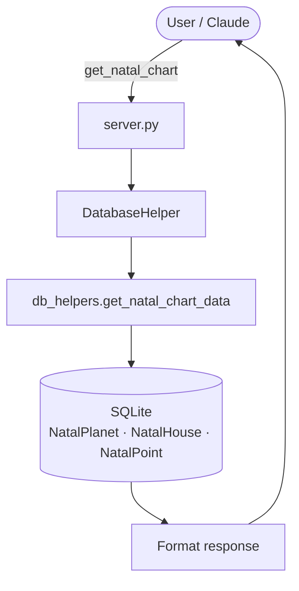
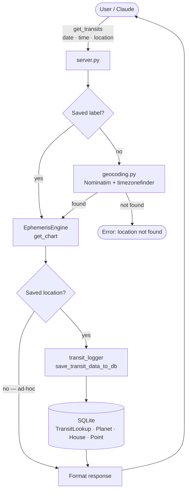
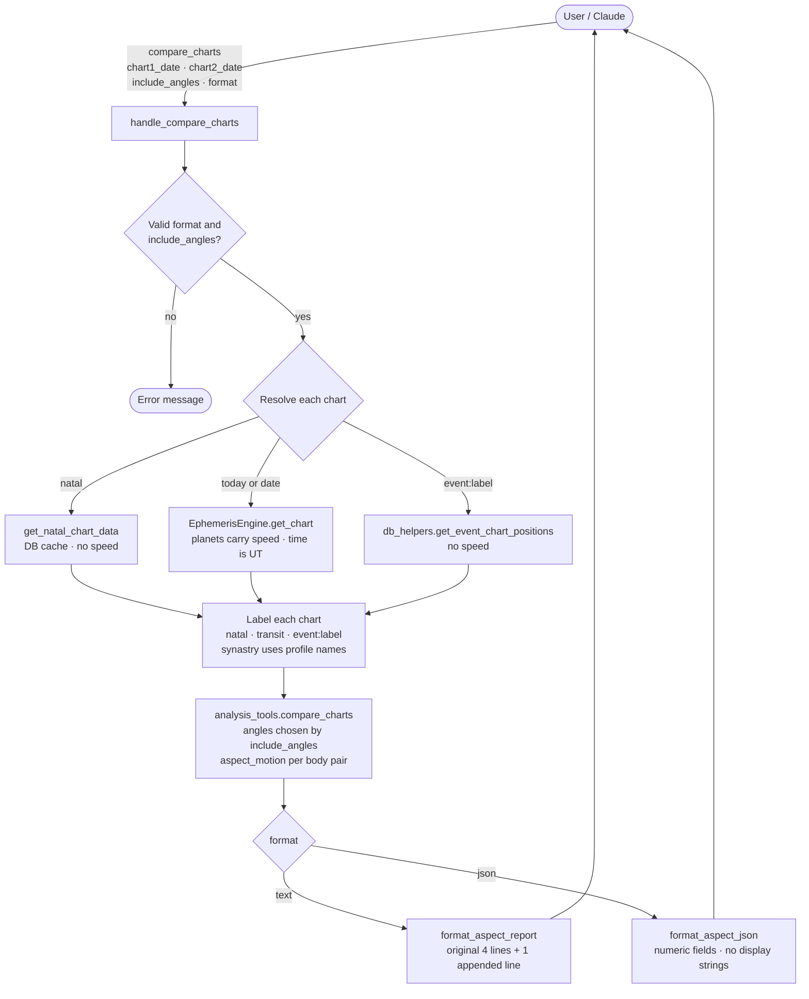
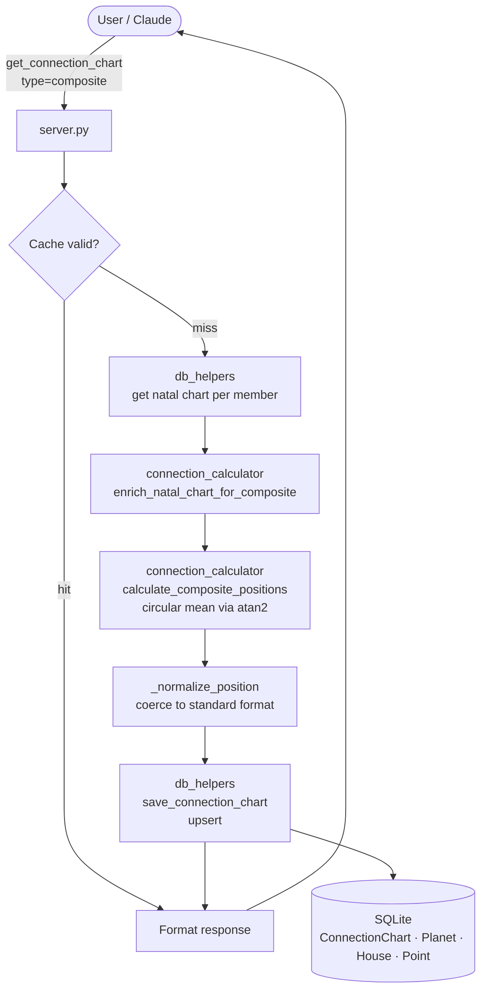
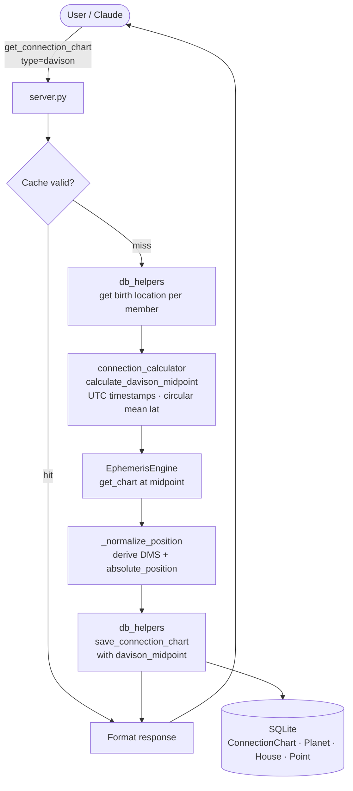
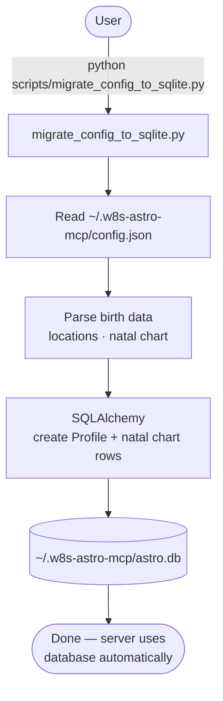

# Project Architecture

## Directory Structure

```
src/w8s_astro_mcp/
├── Core MCP Server
│   ├── __init__.py
│   ├── __main__.py              # Entry point
│   └── server.py                # MCP server — tool registry & routing
│
├── Database Layer
│   ├── database.py              # SQLAlchemy engine, session management
│   └── models/                  # SQLAlchemy ORM models (17 models)
│       ├── __init__.py
│       ├── app_settings.py      # Global settings (owner profile ID)
│       ├── house_system.py      # 7 house systems (Placidus, Koch, etc.)
│       ├── location.py          # Birth/home/saved locations (profile-owned)
│       ├── profile.py           # People's natal charts
│       ├── natal_planet.py      # Planet positions at birth
│       ├── natal_house.py       # House cusps at birth
│       ├── natal_point.py       # Angles (ASC, MC) at birth
│       ├── transit_lookup.py    # Record of every transit check
│       ├── transit_planet.py    # Planet positions for a transit
│       ├── transit_house.py     # House cusps for a transit
│       ├── transit_point.py     # Angles for a transit
│       ├── connection.py        # Named group of 2+ profiles
│       ├── connection_member.py # Many-to-many: connection ↔ profile
│       ├── connection_chart.py  # Cached composite/Davison chart metadata
│       ├── connection_planet.py # Planet positions in a connection chart
│       ├── connection_house.py  # House cusps in a connection chart
│       └── connection_point.py  # Angles in a connection chart
│
├── Analysis & Visualization
│   └── tools/                   # MCP tool handlers
│       ├── __init__.py
│       ├── analysis_tools.py    # Aspects (applying/separating, chart labels, text + JSON formatters), house placements
│       ├── visualization.py     # Chart drawing (matplotlib)
│       ├── profile_management.py # Profile/location CRUD tools
│       ├── connection_management.py # Connection/composite/Davison tools
│       └── event_management.py  # Event charts and electional tools
│
├── Ephemeris & Utilities
│   └── utils/
│       ├── __init__.py
│       ├── ephemeris.py         # EphemerisEngine — pysweph wrapper, chart calculation (planets carry speed)
│       ├── constants.py         # ZODIAC_SIGNS, PLANET_IDS, HOUSE_SYSTEM_CODES
│       ├── db_helpers.py        # High-level database queries
│       ├── connection_calculator.py # Composite & Davison math
│       ├── position_utils.py    # Shared position conversion functions
│       ├── timezones.py         # Local wall-clock time -> UT (zoneinfo), used before every chart calculation
│       ├── chart_health.py      # Are stored natal charts correct? Data notice, caching, rate limit
│       ├── transit_logger.py    # Save transit data to database
│       └── geocoding.py         # Nominatim geocoding + IANA timezone lookup (timezonefinder)
│
```

## Data Flow

### Natal Chart Query


```mermaid
flowchart TD
    U([User / Claude]) -->|get_natal_chart| S[server.py]
    S --> D[DatabaseHelper]
    D --> Q[db_helpers.get_natal_chart_data]
    Q --> DB[(SQLite\nNatalPlanet · NatalHouse · NatalPoint)]
    DB --> R[Format response]
    R --> U
```

### Transit Query (with Auto-Logging)


```mermaid
flowchart TD
    U([User / Claude]) -->|get_transits\ndate · time · location| S[server.py]
    S --> SAVED{Saved label?}
    SAVED -->|yes| E[EphemerisEngine\nget_chart]
    SAVED -->|no| GEO[geocoding.py\nNominatim + timezonefinder]
    GEO -->|found| E
    GEO -->|not found| ERR([Error: location not found])
    E --> LOG{Saved location?}
    LOG -->|yes| SAVE[transit_logger\nsave_transit_data_to_db]
    LOG -->|no — ad-hoc| R[Format response]
    SAVE --> DB[(SQLite\nTransitLookup · Planet · House · Point)]
    DB --> R
    R --> U
```

### Chart Comparison (`compare_charts`) — v0.13.0


```mermaid
flowchart TD
    U([User / Claude]) -->|compare_charts\nchart1_date · chart2_date\ninclude_angles · format| H[handle_compare_charts]
    H --> V{Valid format and\ninclude_angles?}
    V -->|no| ERR([Error message])
    V -->|yes| RES{Resolve each chart}
    RES -->|natal| N[get_natal_chart_data\nDB cache · no speed]
    RES -->|today or date| T[EphemerisEngine.get_chart\nplanets carry speed · time is UT]
    RES -->|event:label| EV[db_helpers.get_event_chart_positions\nno speed]
    N --> L[Label each chart\nnatal · transit · event:label\nsynastry uses profile names]
    T --> L
    EV --> L
    L --> C[analysis_tools.compare_charts\nangles chosen by include_angles\naspect_motion per body pair]
    C --> F{format}
    F -->|text| TX[format_aspect_report\noriginal 4 lines + 1 appended line]
    F -->|json| JS[format_aspect_json\nnumeric fields · no display strings]
    TX --> U
    JS --> U
```

### Composite Chart (pure math, no ephemeris call)


```mermaid
flowchart TD
    U([User / Claude]) -->|get_connection_chart\ntype=composite| S[server.py]
    S --> CACHE{Cache valid?}
    CACHE -->|hit| R[Format response]
    CACHE -->|miss| NATAL[db_helpers\nget natal chart per member]
    NATAL --> ENRICH[connection_calculator\nenrich_natal_chart_for_composite]
    ENRICH --> CALC[connection_calculator\ncalculate_composite_positions\ncircular mean via atan2]
    CALC --> NORM[_normalize_position\ncoerce to standard format]
    NORM --> SAVE[db_helpers\nsave_connection_chart\nupsert]
    SAVE --> DB[(SQLite\nConnectionChart · Planet · House · Point)]
    SAVE --> R
    R --> U
```

### Davison Chart (EphemerisEngine required)


```mermaid
flowchart TD
    U([User / Claude]) -->|get_connection_chart\ntype=davison| S[server.py]
    S --> CACHE{Cache valid?}
    CACHE -->|hit| R[Format response]
    CACHE -->|miss| LOC[db_helpers\nget birth location per member]
    LOC --> MID[connection_calculator\ncalculate_davison_midpoint\nUTC timestamps · circular mean lat]
    MID --> E[EphemerisEngine\nget_chart at midpoint]
    E --> NORM[_normalize_position\nderive DMS + absolute_position]
    NORM --> SAVE[db_helpers\nsave_connection_chart\nwith davison_midpoint]
    SAVE --> DB[(SQLite\nConnectionChart · Planet · House · Point)]
    SAVE --> R
    R --> U
```

### Migration (one-time setup)


```mermaid
flowchart TD
    U([User]) -->|python scripts/migrate_config_to_sqlite.py| M[migrate_config_to_sqlite.py]
    M --> J[Read ~/.w8s-astro-mcp/config.json]
    J --> PARSE[Parse birth data\nlocations · natal chart]
    PARSE --> ORM[SQLAlchemy\ncreate Profile + natal chart rows]
    ORM --> DB[(~/.w8s-astro-mcp/astro.db)]
    DB --> DONE([Done — server uses\ndatabase automatically])
```

## Key Design Decisions

### 1. Database-First Architecture
- **Old:** config.json with cached natal chart
- **New:** SQLite with normalized schema
- **Why:** Enables multi-profile, transit history, proper queries

### 2. AppSettings Table for Owner Identity
- **Old:** Profile.is_primary boolean flag
- **New:** AppSettings.owner_profile_id foreign key
- **Why:** Stable identity for the human operating the server — set once, not switched during sessions. All tools default to the owner unless a specific profile_id is supplied. ON DELETE SET NULL cascade, more extensible.

### 3. Profile-Owned Locations
- **Decision:** All locations require profile_id (no shared/global locations)
- **Why:** Simpler mental model, easier CASCADE deletion, clearer ownership

### 4. Separation of Concerns
- **Models:** Define data structure (SQLAlchemy ORM)
- **Database:** Handle connections, sessions
- **db_helpers:** Provide high-level queries for the server
- **transit_logger:** Handle complex transit inserts
- **connection_calculator:** Pure math — composite means, Davison midpoints
- **position_utils:** Shared low-level conversion functions
- **server.py:** Orchestrate tool routing only

### 5. Auto-Logging Transit Requests
- Every `get_transits` call with a **saved location** logs to database automatically
- Preserves location snapshot for historical accuracy
- Builds queryable history over time
- Graceful degradation (logging failures don't break the request)
- Ad-hoc geocoded locations (inline city names) are intentionally not logged — they have no stable profile FK and would pollute history with one-off lookups

### 6. Connection Chart Caching
- Composite and Davison charts are expensive to compute and deterministic
- Results cached in `connection_charts` + child tables
- `is_valid` flag allows invalidation without deletion
- Adding/removing a connection member invalidates all charts for that connection
- Upsert pattern: recalculating replaces rows, never duplicates

### 7. Position Format Normalization (`_normalize_position`)
- Two sources produce position dicts with different shapes:
  - **Composite math:** `degree` (int), `minutes`, `seconds`, `absolute_position` all present
  - **EphemerisEngine output:** `degree` (decimal float within sign), no `minutes`/`seconds`/`absolute_position`
- `DatabaseHelper._normalize_position()` coerces either format before any DB write
- Reuses `decimal_to_dms()` and `sign_to_absolute_position()` from `position_utils.py`
- `EphemerisEngine` planet dicts also carry `is_retrograde` and, since v0.13.0, `speed` (signed degrees/day). `_normalize_position()` passes extra keys through and every persistence site (`NatalPlanet`, `TransitPlanet`, `EventPlanet`, `ConnectionPlanet`) reads named fields, so `speed` is never written to the database. Charts loaded from the database therefore carry no speed (see decision #15).

### 8. `position_utils.py` — Shared Conversion Module
- `decimal_to_dms()` and `sign_to_absolute_position()` were originally defined in `transit_logger.py` but were needed by `db_helpers.py` too
- Extracted to `utils/position_utils.py` to eliminate cross-module dependency on a persistence module
- `transit_logger.py` now imports from `position_utils` (no behaviour change)

### 9. DatabaseHelper Test Mode
- `DatabaseHelper.__init__()` accepts an optional `db_path` argument
- When provided: creates the file if needed and runs `create_tables()` automatically
- When omitted: production behaviour — uses `get_database_path()`, raises on missing DB
- Enables real integration tests against isolated SQLite files without mocking

## Technology Stack

**Core:**
- Python 3.14
- MCP (Model Context Protocol) server
- SQLAlchemy 2.0 ORM
- SQLite database

**External:**
- pysweph (Python Swiss Ephemeris extension — no binary required)
- matplotlib (chart visualization)
- timezonefinder (offline IANA timezone lookup from coordinates)
- tzdata (timezone database for `zoneinfo` on Windows and minimal containers)

**Dev:**
- pytest (540 tests)
- git (version control)

## Database Schema

See `docs/DATABASE_SCHEMA.md` for full schema documentation.

**22 Models across 5 domains:**

Profiles & Locations (4):
1. AppSettings — owner identity (owner profile ID)
2. HouseSystem — reference data (7 house systems)
3. Location — profile-owned locations
4. Profile — people's natal charts

Natal Charts (3):
5. NatalPlanet, 6. NatalHouse, 7. NatalPoint

Transit History (4):
8. TransitLookup, 9. TransitPlanet, 10. TransitHouse, 11. TransitPoint

Connections — Phase 7 (6):
12. Connection — named group of 2+ profiles
13. ConnectionMember — join table
14. ConnectionChart — cached chart metadata + Davison midpoint
15. ConnectionPlanet, 16. ConnectionHouse, 17. ConnectionPoint

Event Charts — Phase 8 (4):
18. Event — chart metadata (date, time, location, optional profile FK)
19. EventPlanet, 20. EventHouse, 21. EventPoint

App State — v0.14.0 (1):
22. DismissedNotice — notices the user chose to stop seeing (one row per notice key)

## MCP Tools (30 total)

**Core (10):**
dismiss_data_notice, check_ephemeris, download_ephemeris_files, setup_astro_config (deprecated), view_config, get_natal_chart, get_transits, compare_charts, find_house_placements, visualize_natal_chart

**Profile Management (7):**
list_profiles, create_profile, update_profile, delete_profile, setup_owner, add_location, remove_location

**Transit History & Forecasting — Phase 4 (3):**
get_transit_history, find_last_transit, get_ingresses

**Connection Management — Phase 7 (6):**
create_connection, list_connections, add_connection_member, remove_connection_member, get_connection_chart, delete_connection

**Event Charts & Electional Astrology — Phase 8 (4):**
cast_event_chart, list_event_charts, delete_event_chart, find_electional_windows

Notes:
- `get_natal_chart`, `get_transits`, `get_transit_history`, `find_last_transit`, and `visualize_natal_chart` all accept an optional `profile_id` — defaults to owner, supply any profile ID to query about someone else.
- `compare_charts` accepts `chart1_profile_id` and `chart2_profile_id` separately for synastry, and `event:<label>` as a chart source.
- `compare_charts` also accepts `include_angles` (`none` | `natal` | `transit` | `both`) and `format` (`text` | `json`). Each aspect reports `applying`, `days_to_exact` and `exact_utc` when a chart carries planet speeds (transit charts do; natal and saved event charts do not). See decision #15.
- `find_house_placements` accepts either `profile_id` (natal house reference frame) or `connection_id` + `chart_type` (composite/Davison house reference frame); the two are mutually exclusive.

## Future Enhancements

### Planned:
- [ ] Statistics ("how often do I check Mercury?")
- [ ] Database self-healing tools (repair inconsistencies)

### Possible:
- [ ] Web interface for database queries
- [ ] Export transit history to CSV
- [ ] Progressive natal chart (age progression)
- [ ] More house systems (Whole Sign, Equal, etc.)
- [ ] Aspects table (natal-natal, transit-natal, transit-transit)
- [ ] Progressions and solar/lunar returns

---

## Design Decisions

Intentional choices that may look like limitations — with the reasoning and path to changing them.

### get_ingresses — Extended Mode Omits Inner Planets

When `extended=True`, only outer planets (Jupiter through Pluto) are returned. Inner planets (Sun, Moon, Mercury, Venus, Mars) are excluded.

**Why:** Inner planets move fast. Over a multi-year window the Moon alone produces ~146 sign changes per year, Mercury ~15–20, the Sun ~12. A 10-year extended scan would return 1,500+ Moon events — noise, not signal. The primary use case for extended mode is historical or far-future context where outer planet cycles are what matter ("what were the major alignments during the Renaissance?", "when does Pluto enter Aquarius?", "what was the outer planet weather during the life of Jesus?").

**To change this:** Open an issue. The right solution is one of:

1. A `planets` filter parameter on `get_ingresses`
2. A separate `get_inner_planet_ingresses` tool designed for high-volume paginated output

The constraint exists to keep output readable for the primary user (an AI assistant), not as a permanent architectural limitation.

### get_ingresses — Offset and Days Caps

Normal mode: `offset` 0–36,500 days (~100 years), `days` 1–365.
Extended mode: `offset` uncapped (Swiss Ephemeris supports 13,000 BCE – 17,000 CE), `days` 1–3,650.

The 10-year scan cap in extended mode keeps results manageable (~180 events max with outer planets only). For longer ranges, call the tool multiple times with different offsets. The 36,500-day offset cap in normal mode covers retirement planning, generational forecasting, and most practical predictive astrology.

### 10. Inline Location Geocoding (`get_transits`)

`get_transits` resolves the `location` parameter in priority order:

1. Special keywords: `current` / `home` → current home location from DB
2. `birth` → birth location from DB
3. Saved label match (profile-owned locations)
4. Geocode via Nominatim (OpenStreetMap) — any city name that resolves

The old `geocoding.py` used a longitude-band estimate for timezones (US-only, UTC elsewhere). This was replaced with `timezonefinder`, which does a full polygon lookup against the IANA timezone database — necessary for correctness on historical queries in non-US locations (e.g. Bangkok 1995 would have returned UTC instead of Asia/Bangkok).

Ad-hoc locations from step 4 are never saved to the profile or logged to transit history. They exist only for the duration of that ephemeris call.

### 11. Optional Persistence for Event Charts — Phase 8
`cast_event_chart` accepts an optional `label`. Without a label the chart is calculated and returned but never written to the database — frictionless for ad-hoc historical lookups. With a label the chart is saved and becomes addressable by `event:<label>` in `compare_charts` and `list_event_charts`. This mirrors the inline geocoding pattern from Phase 5.

### 12. Void-of-Course Moon Detection — Phase 8
`find_electional_windows` uses a full applying-aspect check for `moon_not_void`, not a heuristic. The implementation computes the Moon's remaining degrees in its current sign, then for each other planet checks whether any of the 5 major aspect angles (conjunction, sextile, square, trine, opposition) falls within that window with orb ≤ 8°. If any applying aspect exists the Moon is not void. This is geometrically correct and sign-boundary-aware, including the Pisces→Aries wrap.

### 13. `compare_charts` `event:` Resolver — Phase 8
The `compare_charts` tool accepts `event:<label>` as a value for `chart1_date` or `chart2_date`. The handler resolves the prefix, looks up the saved event chart by label via `db.get_event_chart_by_label()`, and loads positions via `db.get_event_chart_positions()` which returns the same dict shape as `EphemerisEngine.get_chart()`. No changes to the tool's input schema — just an additional resolution branch in the handler.

### 14. Handler Extraction for Testability — v0.12.0
Complex tool handlers that benefit from direct testing are extracted into standalone
`async def handle_*()` functions above the `@app.call_tool()` dispatcher. The dispatcher
delegates with a single `await handle_*(arguments)`. Tests import and call `handle_*()`
directly without needing to pierce the MCP decorator.

See `handle_find_house_placements()` and `handle_compare_charts()` in `server.py`, with
`tests/test_find_house_placements.py` and `tests/test_compare_charts.py`, for the reference
implementations. Apply this pattern to any new handler whose logic
branches enough to warrant standalone test coverage.

### 15. Transit Direction, Chart Labels, and JSON Output — v0.13.0
`compare_charts` now answers three questions a transit reader needs:

- **Is the aspect building or fading?** `EphemerisEngine._calc_planets()` keeps each planet's
  signed `speed` (degrees/day). `aspect_motion()` in `tools/analysis_tools.py` compares the signed
  separation with the aspect's exact angle and the relative speed to return `applying`
  (True/False/None) and a signed `days_to_exact` (negative = already exact), plus `exact_utc`
  (the moving chart's date/time plus that offset, ISO-8601 UT, rounded to the minute). A body without a speed
  (natal points, DB-loaded event charts) is treated as fixed; with no speed on either side the
  result is `None`. The estimate is linear, so it is unreliable for the Moon and near stations.
- **Which chart does each body belong to?** The handler labels each chart `natal`, `transit` or
  `event:<label>`; when both are the same kind (synastry) it falls back to profile names, then
  "chart 1" / "chart 2". `include_angles` uses those kinds so that `natal` brings only the natal
  angles — a transit chart's own Ascendant/MC swing through the zodiac every day and are noise
  when comparing against a natal chart.
- **Can I consume this without parsing prose?** `format: json` returns the same data with numeric
  fields and no display strings. Text stays the default: the original four lines per aspect are
  unchanged and one line is appended (`Neptune = natal · Mars = transit · separating · exact ~0.6
  days ago (≈ 2026-09-18 19:40 UT)`), so callers that parse the old lines keep working.

Design rules: **the server returns data, callers present it.** Arrows, glyphs, wikilinks and
"which angle hits are worth showing" belong to the caller. The version bump is minor (additive;
no deprecation of `text`).

**Time is UT for transit tools.** The `time` argument of `get_transits`, `find_house_placements` and
`compare_charts` is passed to Swiss Ephemeris as UT. `exact_utc` is UT for that reason; callers convert to
local time. Birth, event and electional times are local and are converted (decision #16).

Known limits: transit-chart angles use the owner's current home location (no location argument on
`compare_charts`); saved event charts carry no speed, so they report `applying: null`.

### 16. Local Times Are Converted to UT — v0.14.0
Swiss Ephemeris takes UT. Before v0.14.0, three tools collected a *local* time plus an IANA timezone
and passed the local time to the ephemeris unchanged: natal chart calculation (`get_natal_chart_data`,
the only place natal charts are calculated, lazily), `cast_event_chart` and `find_electional_windows`.
The timezone was recorded or displayed but never applied, so every chart was off by the location's UTC
offset — wrong Ascendant, MC, houses and Moon.

- **One conversion point.** `utils/timezones.py` (`local_to_utc`, `utc_engine_args`, `utc_to_local`)
  uses `zoneinfo`, so historical DST rules apply. An ambiguous fall-back time takes the first
  occurrence; a nonexistent spring-forward time shifts forward. Bad input raises `TimezoneError`, which
  handlers turn into a clear message.
- **Stored data stays local.** `profiles.birth_time` and `events.event_time` keep meaning what a
  record says; only the value handed to the ephemeris is converted. No existing table or column changes.
- **Electional scans step in UT** (real elapsed minutes, safe across DST changes) and print local times.
- **Transit tools are unchanged.** `get_transits`, `find_house_placements`, `get_ingresses` and
  `compare_charts` take UT by design and have no timezone input; their descriptions say so.
- **Existing data needs recalculating.** `w8s-astro-recalculate` (module `recalculate_natal`) rebuilds
  natal charts — and, with `--events`, saved event charts — from the stored local data. It requires an
  explicit selection, is a dry run unless `--apply` is given, backs up the database first, invalidates
  cached connection charts, and is idempotent. It is a console script rather than a file under
  `scripts/` so `uvx` and `pip` users can run it.
- **Davison charts** already converted correctly (`connection_calculator`).

**Telling users.** Two channels reach the AI without stored state:
- **Server `instructions`** (`SERVER_INSTRUCTIONS`, sent in the MCP initialize response): durable rules — which times
  are local and which UT, and how to treat a data notice.
- **A condition-based data notice** (`utils/chart_health.py`): on the natal-dependent tools, the server recomputes
  each stored natal chart from the profile's local birth data and compares it with what is stored. If any differ, a
  separate content block starting `Data notice:` is appended (at most once per 30 minutes; the health result is
  cached for 10). For `compare_charts` JSON the notice goes into a `notices` list so the JSON stays parseable. It
  names no one, states facts and options, and asks the assistant to get the user's consent before running anything.
  The original output is never altered, a failing check never breaks a tool call, and the notice disappears once the
  charts are recalculated. It is condition-based rather than "first call after upgrade" on purpose: a one-time
  message can be missed and never repeat while the data stays wrong. No "last seen version" state.
- **Dismissal.** `dismiss_data_notice` (`undo=true` reverses it) records the stale profile IDs the user has seen in a
  new `dismissed_notices` table (`DismissedNotice`, unique `notice_key`, JSON `detail`). The notice stays hidden
  while the stale profiles are a subset of those, so fixing some does not bring it back but a different stale chart
  does. It lives in SQLite rather than a config file because the project moved from `config.json` to SQLite in
  v0.9 and the stored IDs only make sense next to this database. It is a **new table only**: `create_all` adds it
  to an existing database on the next start, so there is no migration.

Deliberately not done: silent recalculation of stale charts (users opt in), and a timezone argument for the transit
tools.

## Contributing

When adding features:
1. Models go in `models/`
2. Database queries go in `db_helpers.py`
3. Complex inserts go in separate modules (like `transit_logger.py`)
4. Pure math/calculation logic goes in `utils/` (like `connection_calculator.py`)
5. Shared low-level conversions go in `position_utils.py`
6. MCP tool definitions and handlers go in `tools/`
7. Tool routing goes in `server.py`
8. Always add tests — unit tests for math, integration tests for db_helpers

## Testing

```bash
# Run all tests
pytest

# Connection db_helper integration tests only
pytest tests/test_connection_db_helpers.py

# Connection math tests only
pytest tests/test_connection_calculator.py

# Model tests only
pytest tests/models/

# compare_charts: motion, labels, include_angles, text/JSON formatters, handler
pytest tests/test_compare_charts.py

# Local -> UT conversion: util, natal, events/electional, recalculation tool
pytest tests/test_timezones.py tests/test_natal_local_time.py tests/test_event_time_conversion.py tests/test_recalculate_natal.py

# Specific test file
pytest tests/models/test_connections.py
```

## Migration Guide

**v0.8 → v0.9 (JSON to SQLite):**
1. Run: `python scripts/migrate_config_to_sqlite.py`
2. Database created at: `~/.w8s-astro-mcp/astro.db`
3. Server automatically uses new database
4. Keep config.json as backup

**v0.11 → v0.12 (owner profile rename):**
1. Run: `python scripts/migrate_owner_profile.py`
2. Renames `current_profile_id` → `owner_profile_id` in `app_settings` table
3. Idempotent — safe to run multiple times
4. After migrating, use `setup_owner` to confirm your profile is set

**v0.13 → v0.14.0 (local times converted to UT):**
1. Run `w8s-astro-recalculate --all` to see what would change, then `w8s-astro-recalculate --all --apply` (a database backup is written first)
2. Add `--events` to include saved event charts; review those first — a chart saved for a birth clock time labelled with a different timezone is not a relocation chart
3. Stored profiles keep their local birth times. One new small table (`dismissed_notices`) is added to your database automatically on the next start; there is nothing to migrate

**v0.12 → v0.13 (transit direction, chart labels, JSON output):**
1. No migration — there is no schema change and nothing to run
2. Additive: `compare_charts` text output keeps its four existing lines per aspect and gains one appended line; new options (`include_angles`, `format`) are opt-in
3. Callers that parse the old text should read the four existing lines and ignore the fifth (see the CHANGELOG entry)

**For new users:**
- No migration needed
- Server initializes the database automatically on first run

## License

See LICENSE_NOTICE.md
