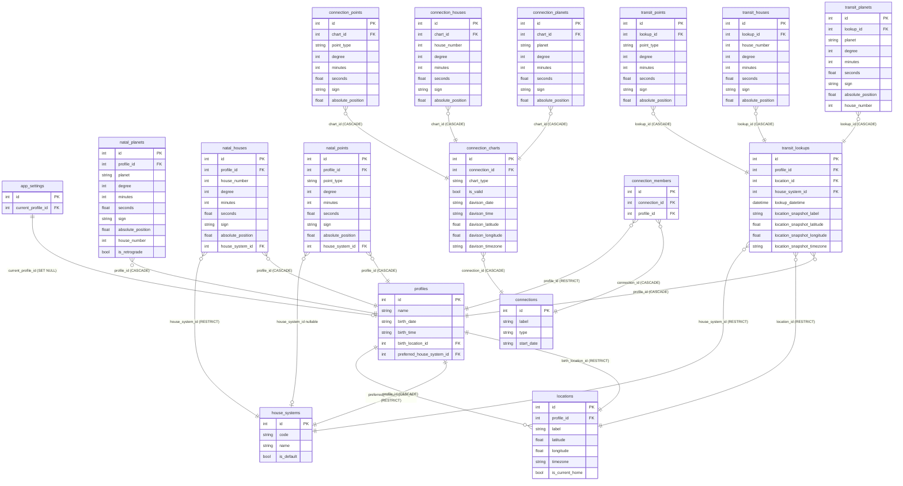

# Database Schema — w8s-astro-mcp

SQLite database at `~/.w8s-astro-mcp/astro.db`. All tables created by
SQLAlchemy ORM from models in `src/w8s_astro_mcp/models/`.

## Design Principles

- **Normalized for queryability** — separate tables enable complex SQL analysis
- **Calculation metadata** — track ephemeris version and method for reproducibility
- **Historical accuracy** — denormalized location snapshots preserve transit context
- **Multi-house system support** — charts calculated with any supported system
- **Profile-owned locations** — all locations belong to a profile; no shared/global concept
- **Lazy chart caching** — connection charts calculated on demand, cached with validity flag

---

## Full Entity Relationship Diagram



---

## Domain Diagrams

### Core: Profiles, Locations, Settings


### Natal Charts


### Transit History


### Connections (Phase 7)


---

## Connection Chart Lifecycle

The `connection_charts.is_valid` flag drives the cache. This state diagram
shows the full lifecycle of a chart from creation through invalidation and
recalculation.


---

## Key Constraints & Business Rules

**Uniqueness:**
- One natal planet per planet per profile — `UNIQUE(profile_id, planet)`
- One composite and one Davison chart per connection — `UNIQUE(connection_id, chart_type)`
- One membership per person per connection — `UNIQUE(connection_id, profile_id)`
- One location label per profile — `UNIQUE(profile_id, label)`
- One transit lookup per profile/datetime/location/house system combination

**Cascade behavior:**
- Deleting a profile → cascades to natal chart, transit lookups, locations, connection memberships
- Deleting a connection → cascades to members, charts, and all chart positions
- Deleting a connection chart → cascades to all its planets/houses/points

**Restrict behavior:**
- Cannot delete a profile that is a member of a connection (remove them first)
- Cannot delete a location that has transit lookups referencing it
- Cannot delete a house system that is in use

**Position format:** All positions stored as `degree` (int, 0-29), `minutes` (int, 0-59), `seconds` (float, 0-59.999) within sign, plus `absolute_position` (float, 0-359.999°) for aspect math. The `_normalize_position()` method in `DatabaseHelper` coerces swetest decimal-degree output into this format before any write.

---

## Example Queries

```sql
-- Which planets do I check most often in transits?
SELECT tp.planet, COUNT(*) as checks
FROM transit_planets tp
GROUP BY tp.planet
ORDER BY checks DESC;

-- Transits when Moon was in 7th natal house
SELECT tl.lookup_datetime, tp.sign, tp.degree
FROM transit_lookups tl
JOIN transit_planets tp ON tp.lookup_id = tl.id
WHERE tp.planet = 'Moon' AND tp.house_number = 7
ORDER BY tl.lookup_datetime DESC;

-- All fire sign Suns across profiles
SELECT p.name, np.sign, np.degree
FROM profiles p
JOIN natal_planets np ON np.profile_id = p.id
WHERE np.planet = 'Sun'
  AND np.sign IN ('Aries', 'Leo', 'Sagittarius');

-- All connections a profile belongs to
SELECT c.label, c.type
FROM connections c
JOIN connection_members cm ON cm.connection_id = c.id
WHERE cm.profile_id = 1;

-- Stale connection charts needing recalculation
SELECT c.label, cc.chart_type
FROM connections c
JOIN connection_charts cc ON cc.connection_id = c.id
WHERE cc.is_valid = 0;
```

---

## Future Expansion

### `aspects` (not yet implemented)
Precomputed aspects between planet pairs, enabling queries like
"show me all Saturn squares to natal Sun."

Fields would include: profile/lookup FK, planet pair, aspect type
(conjunction/trine/square/etc.), orb, applying/separating flag, and
aspect category (natal-natal, transit-natal, transit-transit).

### `progressions` and `returns` (not yet implemented)
Secondary progressions, solar arcs, solar returns, lunar returns.
Would follow the same planet/house/point child-table pattern as
natal and transit tables.
