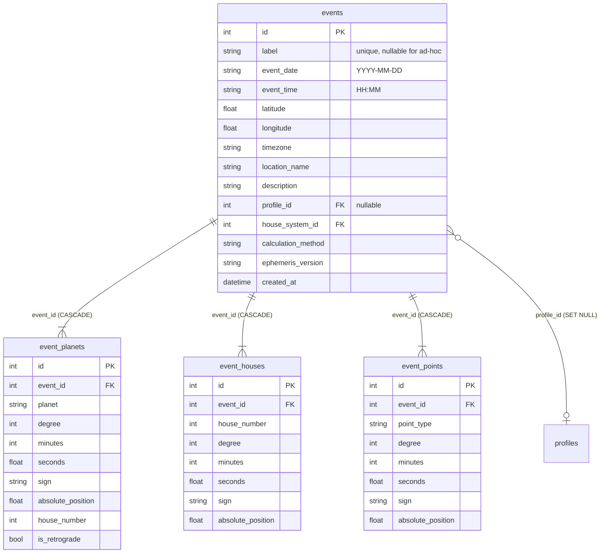
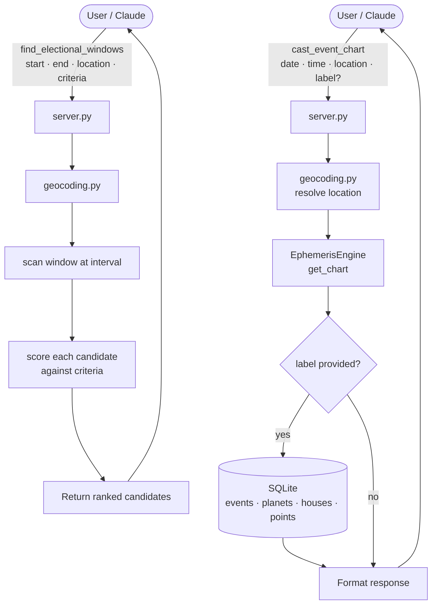

# Phase 8: Event Charts & Electional Astrology — Planning

## Overview

Event charts are horoscopes cast for a moment in time and place — no profile or
person required. A wedding, a business launch, a historical battle, the moment a
treaty was signed. They use the same planet/house/point structure as natal charts
but belong to an event, not a person.

Electional astrology inverts this: instead of analyzing a fixed moment, you scan a
time window to find candidate moments that satisfy astrological criteria — "find me
a good time this week to sign a contract."

Both features build on the same foundation. Event charts come first; electional
scanning is a query layer on top.

---

## Design Decisions

### 1. Optional Persistence

Event charts can be returned on demand (no save) or named and stored for later
comparison. The `cast_event_chart` tool accepts an optional `label` parameter:

- **No label** — calculates and returns the chart; nothing written to DB.
- **With label** — calculates, saves, and returns. Saved charts are queryable
  and comparable.

This mirrors the inline geocoding pattern from Phase 5: ad-hoc use is frictionless,
intentional use gets persistence.

### 2. Comparable via `compare_charts`

The existing `compare_charts` tool accepts `chart1_date` / `chart2_date`. Event
charts will be addressable by label so you can write:

```
compare_charts(chart1_date="natal", chart2_date="event:wedding-2026")
```

The tool handler resolves `event:` prefixes to the saved event chart. No changes
to the tool signature — just an additional resolver in the handler.

### 3. Schema Follows the Natal Pattern

Event charts use the same planet/house/point child-table structure as natal charts.
No new column shapes needed — just a new parent table (`events`) and three child
tables (`event_planets`, `event_houses`, `event_points`).

Event charts are not profile-owned. They are standalone entities. A saved event
chart can optionally reference a profile (e.g. "this wedding was for Todd") but
does not require one.

### 4. Electional Scanning

`find_electional_windows` scans a time window at a configurable interval and
scores each candidate moment against a set of criteria. Returns a ranked list of
candidate datetimes with scores and notes — it does not cast or save full charts
for every candidate (that would be expensive). The caller can then use
`cast_event_chart` on any candidate they want to inspect or save.

---

## Database Schema

### New Tables

```
events
  id                  PK
  label               string — unique, user-defined (nullable for ad-hoc)
  event_date          string — YYYY-MM-DD
  event_time          string — HH:MM
  latitude            float
  longitude           float
  timezone            string — IANA
  location_name       string — human-readable snapshot
  description         string — optional notes
  profile_id          FK → profiles (nullable — SET NULL on delete)
  house_system_id     FK → house_systems
  calculation_method  string
  ephemeris_version   string
  created_at          datetime

event_planets
  id                  PK
  event_id            FK → events (CASCADE)
  planet              string
  degree              int
  minutes             int
  seconds             float
  sign                string
  absolute_position   float
  house_number        int
  is_retrograde       bool

event_houses
  id                  PK
  event_id            FK → events (CASCADE)
  house_number        int
  degree              int
  minutes             int
  seconds             float
  sign                string
  absolute_position   float

event_points
  id                  PK
  event_id            FK → events (CASCADE)
  point_type          string
  degree              int
  minutes             int
  seconds             float
  sign                string
  absolute_position   float
```

### ERD



---

## MCP Tools (4 new)

### `cast_event_chart`

Cast a chart for any moment and place. Optionally save it by providing a label.

**Parameters:**
- `date` — YYYY-MM-DD (required)
- `time` — HH:MM (required)
- `location` — city name or saved label (required; uses Phase 5 geocoding)
- `label` — if provided, saves the chart with this name (optional)
- `description` — optional notes (only used when saving)
- `profile_id` — associate with a profile (optional)

**Returns:** Full chart with planets, houses, and points. If saved, confirms the
label for later reference.

---

### `list_event_charts`

List all saved event charts.

**Parameters:**
- `profile_id` — filter to events associated with a profile (optional)

**Returns:** id, label, date, time, location_name, description, associated profile
name (if any).

---

### `delete_event_chart`

Delete a saved event chart and all its planets/houses/points.

**Parameters:**
- `label` — label of the event to delete (required)
- `confirm` — must be `true` (required)

---

### `find_electional_windows`

Scan a time window and return candidate moments that score well against
astrological criteria.

**Parameters:**
- `start_date` — YYYY-MM-DD (required)
- `end_date` — YYYY-MM-DD (required; max 90-day window)
- `location` — city name or saved label (required)
- `interval_minutes` — how often to sample; default 60, min 15, max 360
- `criteria` — list of named criteria to score against (see below)

**Criteria (combinable):**
- `moon_not_void` — Moon is not void of course
- `no_retrograde_inner` — Mercury, Venus, Mars all direct
- `no_retrograde_outer` — Jupiter, Saturn, Uranus, Neptune, Pluto all direct
- `no_retrograde_all` — all planets direct
- `moon_waxing` — Moon between new and full
- `moon_waning` — Moon between full and new
- `benefic_angular` — Venus or Jupiter in houses 1, 4, 7, or 10
- `asc_not_late` — Ascendant not in last 3° of a sign (unstable degree)

**Returns:** Ranked list of candidate windows (datetime, score, passing criteria,
notes). Does not save charts — use `cast_event_chart` to inspect any candidate
further.

---

## Data Flow



---

## compare_charts Integration

No changes to the `compare_charts` tool signature. The handler gains an additional
resolver step:

```
chart1_date / chart2_date resolution order:
  1. "natal"          → current profile's natal chart
  2. "today"          → current transits
  3. "event:<label>"  → saved event chart by label
  4. YYYY-MM-DD       → ad-hoc chart at that date (existing behaviour)
```

Example usage:
```
compare_charts(chart1_date="natal", chart2_date="event:wedding-2026")
compare_charts(chart1_date="event:company-founding", chart2_date="today")
```

---

## Example Conversations

**Casting and saving:**
> "Cast a chart for my wedding on June 14, 2026 at 4pm in Chicago and save it as
> 'wedding-2026'."

**Ad-hoc analysis:**
> "What does the sky look like on the day the Berlin Wall fell — November 9, 1989
> at 11pm in Berlin?"

**Comparing to natal:**
> "Compare my natal chart to the chart for the day I started my company."

**Electional scan:**
> "Find me good windows to sign a contract next month in Dallas — I want the Moon
> not void, no Mercury retrograde, and ideally Venus angular."

---

## Implementation Notes

- `cast_event_chart` reuses `EphemerisEngine.get_chart()` and
  `_normalize_position()` unchanged — no new ephemeris logic needed.
- Ad-hoc event charts (no label) follow the same pattern as ad-hoc geocoded
  locations: calculated, returned, not persisted.
- `find_electional_windows` calls `EphemerisEngine.get_chart()` for each
  interval step — a 90-day window at 60-minute intervals is ~1,080 calls.
  pysweph is fast enough for this; no async or batching needed.
- Void of course Moon detection: Moon is void after its last exact aspect to
  any planet before changing signs. This requires a small lookahead scan and
  is the most complex criterion to implement.
- The `event:` prefix in `compare_charts` is a new resolver path in
  `db_helpers.py` — no changes to the tool definition or MCP schema.

---

## What This Is Not

- Event charts are not profiles. They have no birth data concept, no house
  system preference stored per event, no natal chart auto-calculation.
- `find_electional_windows` does not return full charts for each candidate —
  just scores and metadata. Full chart inspection is a separate
  `cast_event_chart` call.
- No "update event chart" tool. If the date/time/location changes, delete and
  re-cast. Event charts are immutable once saved.

---

## Estimated Scope

- 4 new models: `Event`, `EventPlanet`, `EventHouse`, `EventPoint`
- 4 new MCP tools: `cast_event_chart`, `list_event_charts`, `delete_event_chart`, `find_electional_windows`
- 1 resolver addition in `compare_charts` handler
- 1 new db_helpers module: `event_helpers.py`
- Void-of-course detection utility in `utils/`
- Estimated tests: ~40 new (models, helpers, electional criteria, integration)
